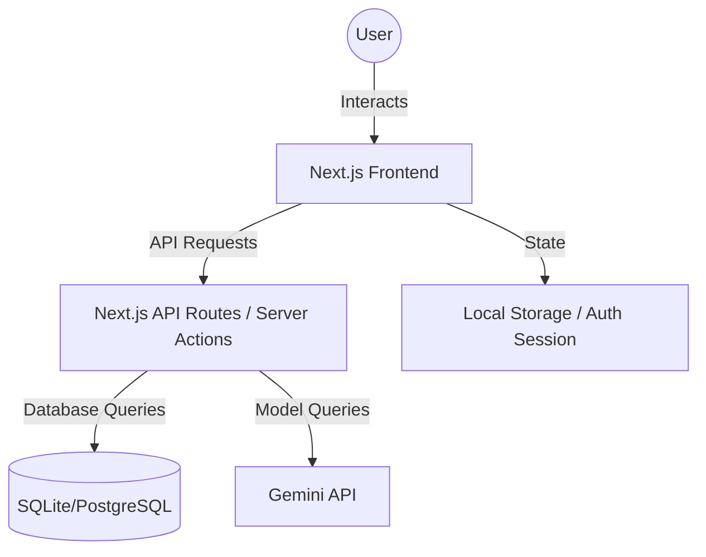

# System Architecture - Project LiveFit

## 1. High-Level Architecture
The application follows a modern full-stack architecture using Next.js. It leverages server-side rendering (SSR), client-side interactivity, and serverless functions for AI processing.

## 2. Component Diagram

## 3. Technology Stack
- **Framework**: [Next.js](https://nextjs.org/) (App Router)
- **Language**: TypeScript
- **Styling**: Modern CSS / Tailwind CSS
- **Database**: Prisma ORM with SQLite (local development) / PostgreSQL (production)
- **AI Engine**: [Google Gemini API](https://ai.google.dev/) (Free tier)
- **Authentication**: NextAuth.js / Clerk
- **Deployment**: Vercel

## 4. Data Flow
1. **User Input**: User types "Had 2 eggs for breakfast" in the chat.
2. **Parsing**: The prompt is sent to the Gemini API with a system instruction to extract nutritional data in JSON format.
3. **Storage**: The backend saves the extracted data to the database associated with the user's ID.
4. **UI Update**: The frontend fetches the updated daily log and refreshes the progress bars and tables.

## 5. Security & Privacy
- User data is isolated by UserID.
- API keys are stored in environment variables.
- HTTPS for all communications.
